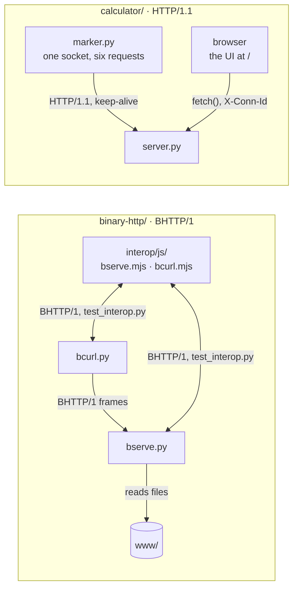

# Network Architecture

**Two ways to answer one question: where does a message end?**

Python 3.8+ · standard library only · raw sockets · no frameworks

<p align="center">
  <a href="calculator/"></a>
</p>
<p align="center"><sub>The calculator's browser UI after the marking sequence: all six graded requests passed on one TCP connection (conn 1, requests #6–#11).</sub></p>

## The idea

HTTP/1.0 ended a message at EOF: the server closed the connection, and the end of the stream was the end of the body.
Once the connection stays open for the next request, that signal is gone, so the protocol has to frame every message
itself. The calculator does it in text, where the head ends at CRLFCRLF and the body is exactly `Content-Length`
bytes. BHTTP/1 does it in binary, with an 8-octet header that carries each frame's length.

## The projects

### Calculator: HTTP/1.1 keep-alive on a raw socket

An HTTP/1.1 server for `/add`, `/sub`, `/mul` and `/div` that keeps the TCP connection open between requests. The
arithmetic is trivial. The work is in cutting each request out of the byte stream exactly, so the next one can start
on the same connection.

- The marker's six requests (200, 200, 200, 400, 404, 405) all pass on **one connection**. `marker.py` reports
  *1 TCP handshake, 6 responses, socket still open: True*.
- Semantic errors (division by zero, a bad number, no `Host`, `/pow`, `POST /add`) are answered and the connection
  stays open. Broken framing is answered with `Connection: close`, and then the server closes.
- Stretch goals: `Connection: close`, a 60 s idle timeout plus a 10 s request clock, chunked request bodies, pipelining.
- A browser UI at `/`, served by the same server, shows which connection answered each request, using the
  `X-Conn-Id` and `X-Conn-Request` headers.

Run it from `calculator/`:

| | macOS / Linux | Windows (PowerShell) |
|---|---|---|
| start the server | `python3 server.py` | `python server.py` |
| open the UI | <http://localhost:8080> | <http://localhost:8080> |
| replay the marker | `python3 marker.py` | `python marker.py` |

**→ [Full README](calculator/README.md)**

### BHTTP/1: HTTP, in binary

HTTP semantics (method, path, status, headers, body) carried in length-prefixed binary frames over one persistent
TCP connection. `bserve` serves files from a folder and `bcurl` fetches them. The only thing that passes between the
two is the spec.

- An 8-octet frame header: **Length 16 · Type 8 · Flags 8 · Stream ID 32**. HTTP/2 uses 24/8/8/31, and
  [DESIGN.md](binary-http/DESIGN.md) defends each difference.
- Header blocks use a 10-name static table plus length-prefixed literals. There is no Huffman coding and no dynamic
  table.
- **Unknown frame types MUST be skipped.** Types `0xF0`–`0xFF` are reserved as "grease", and `--grease` sends them
  to prove that peers skip them.
- A clean-room Node.js implementation, written from `SPEC.md` alone, interoperates with the Python programs in both
  directions.

Run it from `binary-http/`:

| | macOS / Linux | Windows (PowerShell) |
|---|---|---|
| start the server | `./bserve ./www 9000` | `.\bserve.cmd .\www 9000` |
| fetch a file, with a hexdump of every frame | `./bcurl -v localhost:9000/index.html` | `.\bcurl.cmd -v localhost:9000/index.html` |

**→ [Full README](binary-http/README.md)**

## Side by side

| | Calculator | BHTTP/1 |
|---|---|---|
| **Framing** | text: an HTTP/1.1 head (lines ending in CRLF), then an optional body | binary: an 8-octet header, then `Length` octets of payload |
| **How the end of a message is found** | the head ends at the empty line (CRLFCRLF); the body is exactly `Content-Length` octets, or chunks up to the `0` chunk | every frame states its `Length`; a message is one HEADERS frame plus DATA frames, and ends at the frame flagged `END_STREAM` |
| **Error handling** | semantic error → 400 / 404 / 405, connection stays open · framing error → `Connection: close`, then close | stream error → 400 on that stream, connection stays open · connection error → `GOAWAY(PROTOCOL_ERROR)`, then close |
| **Entry points** | `server.py`, `marker.py`, the UI at `/` | `bserve.py`, `bcurl.py` (launchers: `bserve`, `bcurl`, and `.cmd` versions for Windows), `interop/js/` |
| **Tests** | 34 | 64: 17 codec, 25 end-to-end, 22 interop (the interop ones need Node.js) |
| **README** | [calculator/README.md](calculator/README.md) | [binary-http/README.md](binary-http/README.md) |

## How the pieces connect



## Tests

These counts are from a fresh run of every suite. Use `python3` on macOS/Linux.

| Suite | Tests | Run from | Command |
|---|---|---|---|
| calculator: `tests/test_server.py` | 34 | `calculator/` | `python -m unittest discover -s tests -v` |
| binary-http: `tests/test_codec.py` | 17 | `binary-http/` | `python -m unittest -v tests.test_codec` |
| binary-http: `tests/test_e2e.py` | 25 | `binary-http/` | `python -m unittest -v tests.test_e2e` |
| binary-http: `tests/test_interop.py` (skipped without Node.js) | 22 | `binary-http/` | `python -m unittest -v tests.test_interop` |
| binary-http: all three files | 64 | `binary-http/` | `python -m unittest discover -s tests -v` |
| the JavaScript implementation's own self-test | 122 checks | `binary-http/interop/js/` | `node selftest.mjs` |

## Checklist against the brief

<details>
<summary><strong>Calculator</strong> (<a href="calculator/README.md">README</a>)</summary>

- [x] add / sub / mul / div → 200; div by zero, bad number, no Host → 400; `/pow` → 404; POST → 405
- [x] one socket, every request: `marker.py` shows *socket still open: True, 1 TCP handshake, 6 responses*
- [x] exactly Content-Length bytes consumed; byte n+1 left for the next request (10 framing tests, mutation-checked)
- [x] stretch: `Connection: close`, a defended idle timeout (60 s, plus a separate 10 s request clock), chunked request bodies, pipelining
- [x] extra: a one-file UI served by the same raw-socket server; `X-Conn-Id` / `X-Conn-Request` headers show which connection answered, and it runs the marking sequence in the browser

</details>

<details>
<summary><strong>Binary HTTP</strong> (<a href="binary-http/README.md">README</a>)</summary>

- [x] fixed 8-octet frame header, 16/8/8/32, defended against HTTP/2's 24/8/8/31 ([DESIGN.md](binary-http/DESIGN.md))
- [x] ten static header names plus length-prefixed literals
- [x] unknown frame types MUST be skipped, with reserved "grease" types that prove it
- [x] `bserve`: path → file under a root, 404, 400 on a malformed frame, connection kept open
- [x] `bcurl`: body to stdout, `-v` hexdumps every frame, non-zero exit on 4xx/5xx, never a second connection
- [x] hand-in 1: the spec ([SPEC.md](binary-http/SPEC.md))
- [x] hand-in 2: the programs
- [x] hand-in 3: annotated hexdump of a real request and response ([HEXDUMP.md](binary-http/HEXDUMP.md))
- [x] "a client that only works against your own server is an implementation, not a protocol": a clean-room
      JavaScript implementation written from the spec alone interoperates with ours

</details>

## Repository map

```
.
├── calculator/              HTTP/1.1 keep-alive calculator
│   ├── server.py            the server: framing, routing, the arithmetic, the page at /
│   ├── marker.py            replays the marker's six requests on one socket
│   ├── web/index.html       the browser UI, in one file
│   ├── docs/ui.png          the screenshot at the top of this page
│   └── tests/               34 end-to-end tests over real sockets
├── binary-http/             BHTTP/1, HTTP in binary frames
│   ├── SPEC.md              the protocol
│   ├── DESIGN.md            the defence of every field width
│   ├── HEXDUMP.md           one real request and response, every octet annotated
│   ├── bserve.py, bcurl.py  the server and the client (plus launchers, and .cmd ones for Windows)
│   ├── bhttp/               shared code: frames, header blocks, hexdump, sockets
│   ├── www/                 the sample site bserve serves
│   ├── interop/js/          the clean-room Node.js implementation, written from SPEC.md
│   ├── tools/annotate.py    captures a real exchange and annotates it
│   ├── captures/            the raw bytes behind HEXDUMP.md
│   └── tests/               64 tests: codec, end-to-end, interop
├── PLAN.md                  the analysis and the plan
└── README.md                this page
```

**Read next**

- [calculator/README.md](calculator/README.md): one connection, many requests; the byte where a request ends; the decisions behind the design
- [binary-http/README.md](binary-http/README.md): running `bserve` and `bcurl`, their options, and the tests
- [binary-http/SPEC.md](binary-http/SPEC.md): the protocol, written so that a stranger can implement it
- [binary-http/DESIGN.md](binary-http/DESIGN.md): why 16/8/8/32 and not HTTP/2's 24/8/8/31
- [binary-http/HEXDUMP.md](binary-http/HEXDUMP.md): a real exchange, octet by octet
- [PLAN.md](PLAN.md): how the work was planned against the brief
