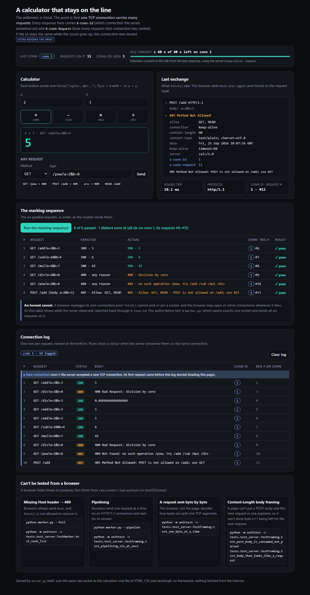
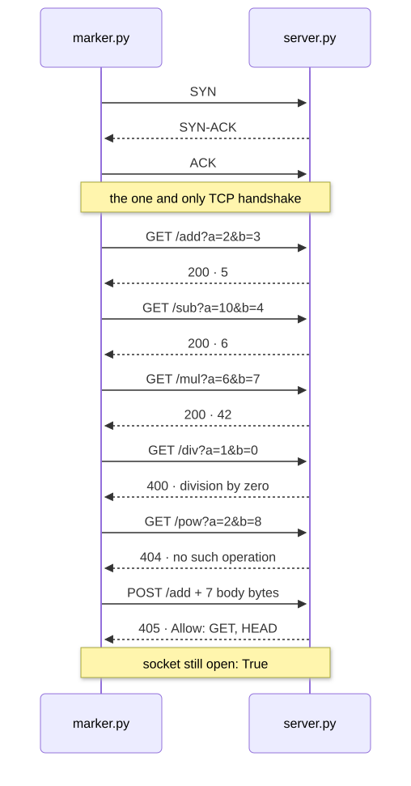
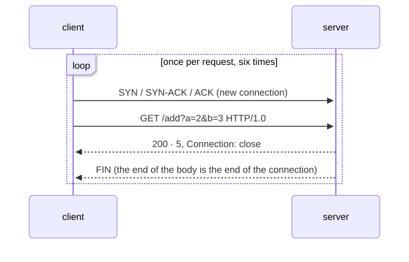

# A calculator that stays on the line

## 1. What and why

This is an HTTP/1.1 server written on a raw socket, using Python's standard library only (`socket`, `threading`, no
`http.server`). It answers `/add`, `/sub`, `/mul` and `/div`. The arithmetic is trivial. The point of the assignment
is that **one TCP connection carries many requests**. With HTTP/1.0 every request cost a new connection, and the end
of the body was simply the end of the connection. Here the connection stays open, so the server has to find the exact
byte where each request ends and the next one begins. Almost all of the code in [server.py](server.py) exists to get
that right.

## 2. Quick start

Run everything from this folder, `calculator/`.

| | macOS / Linux | Windows (PowerShell) |
|---|---|---|
| start the server (localhost:8080) | `python3 server.py` | `python server.py` |
| open the UI | `open http://localhost:8080` (macOS) or `xdg-open http://localhost:8080` | `start http://localhost:8080` |
| replay the marker's test, one socket | `python3 marker.py` | `python marker.py` |
| same six requests in a single `send()` | `python3 marker.py --pipeline` | `python marker.py --pipeline` |
| run the tests | `python3 -m unittest discover -s tests -v` | `python -m unittest discover -s tests -v` |

The server needs Python 3.8 or newer and nothing else. On Windows, `py` works in place of `python` if that is how
Python was installed. Stop the server with Ctrl+C.

## 3. The UI



That's the page at `http://localhost:8080` after running the marking sequence. All six graded requests passed, and the
server answered every one of them on connection 1: the page load, then requests #2 to #11. Section 11 explains how
the page knows this.

## 4. The marker's test, for real

`python marker.py` opens one socket with `socket.create_connection`, sends the six requests from the assignment slide
on it one at a time, and then checks that the socket is still open:

```
s = socket.create_connection(('localhost', 8080))   # local port 49672

  GET /add?a=2&b=3           -> 200   5
  GET /sub?a=10&b=4          -> 200   6
  GET /mul?a=6&b=7           -> 200   42
  GET /div?a=1&b=0           -> 400   (400 Bad Request: division by zero)
  GET /pow?a=2&b=8           -> 404   (404 Not Found: no such operation /pow; try /add /sub /mul /div)
  POST /add                  -> 405   (405 Method Not Allowed: POST is not allowed on /add; use GET)

  socket still open: True
  1 TCP handshake, 6 responses   (same local port 49672 throughout)
```

The server's log for the same run shows one `open`, six requests and one `closed`, all on connection 1:

```
[conn 1 ::1:49672] open
[conn 1 ::1:49672] #1 GET /add?a=2&b=3 HTTP/1.1 -> 200 '5'
[conn 1 ::1:49672] #2 GET /sub?a=10&b=4 HTTP/1.1 -> 200 '6'
[conn 1 ::1:49672] #3 GET /mul?a=6&b=7 HTTP/1.1 -> 200 '42'
[conn 1 ::1:49672] #4 GET /div?a=1&b=0 HTTP/1.1 -> 400 '400 Bad Request: division by zero'
[conn 1 ::1:49672] #5 GET /pow?a=2&b=8 HTTP/1.1 -> 404 '404 Not Found: no such operation /pow; try /add /sub /mul /div'
[conn 1 ::1:49672] #6 POST /add HTTP/1.1 -> 405 '405 Method Not Allowed: POST is not allowed on /add; use GET'
[conn 1 ::1:49672] closed: client closed the connection; 6 response(s) on this one connection
```

`python marker.py --pipeline` sends all six requests in a single `sendall()` and prints the same six answers, in
order. `python marker.py --full` adds three more: `/div?a=9&b=3` → `3`, `a=x` → 400, and a request with no `Host`
header → 400. The socket is still open after all nine.

## 5. One connection, many requests

This is what `marker.py` does on the wire. There's one TCP handshake, six request/response pairs, and the connection is
still open at the end:

<picture>
  <source media="(prefers-color-scheme: dark)" srcset="docs/diagrams/one-connection-dark.svg">
  
</picture>
<sub>Diagram source: <a href="docs/diagrams/one-connection.mmd">one-connection.mmd</a></sub>

With HTTP/1.0 (or `Connection: close`) every request pays for its own handshake. The server marks the end of each
response by closing the connection:

<picture>
  <source media="(prefers-color-scheme: dark)" srcset="docs/diagrams/http10-per-request-dark.svg">
  
</picture>
<sub>Diagram source: <a href="docs/diagrams/http10-per-request.mmd">http10-per-request.mmd</a></sub>

The server supports both. An HTTP/1.1 request stays open unless it says `Connection: close`. An HTTP/1.0 request
closes unless it says `Connection: keep-alive` (`Request.keep_alive`).

## 6. Where does a request end?

`recv()` returns whatever TCP happens to have: half a request, or two and a half. Nothing in the server assumes one
`recv()` is one request. `Reader` owns the bytes that have arrived but aren't used yet (`Reader.buf`). Each request
takes exactly its own bytes out, and everything after them stays in the buffer.

Here is one `recv()` holding a `POST` with `Content-Length: 7`, its 7 body bytes, and the next `GET`. This is exactly
what `test_post_body_is_consumed_not_parsed` sends. Each `\r\n` is drawn as four characters but is two bytes.

```
0                                                          50      57
┌───────────────────── head: 50 bytes ─────────────────────┬ body ─┬─────────────── next request ────────────────
│POST /add HTTP/1.1\r\nHost: x\r\nContent-Length: 7\r\n\r\n│a=2&b=3│GET /add?a=40&b=2 HTTP/1.1\r\nHost: x\r\n\r\n
└──────────────────────────────────────────────────────────┴───────┴─────────────────────────────────────────────
                                                           ▲       ▲
                                                           │       └── the cut: discard(7) stops here, and byte 57 onward
                                                           │           stays in Reader.buf for the next read_request()
                                                           └── read_line() stopped at the empty line; Content-Length: 7
```

The server answers the POST with 405, but it **consumes the 7 body bytes first**. If it didn't, `a=2&b=3GET /add?...`
would be parsed as the next request line. How long the body is comes from the headers (RFC 9112 §6.3), never from
how the bytes happened to arrive:

<picture>
  <source media="(prefers-color-scheme: dark)" srcset="docs/diagrams/framing-flow-dark.svg">
  
</picture>
<sub>Diagram source: <a href="docs/diagrams/framing-flow.mmd">framing-flow.mmd</a></sub>

**Pipelining falls out of this for free.** If the next request is already in `Reader.buf`, it's answered before the
server calls `recv()` again.

The 10 tests in `TestFraming` break this in both directions: a POST body and the next GET in one segment, a body that
*looks like* a request, a request sent one byte at a time, a body split across two segments, six pipelined requests,
and a chunked body. As a mutation check, turning `discard()` into a no-op makes 5 of those 10 tests fail, and clearing
the leftover bytes after each request makes 6 fail.

## 7. Two kinds of error

| | Examples | What the server knows | What it does |
|---|---|---|---|
| **Semantic**: the request was framed correctly but can't be answered | `/div?a=1&b=0`, `a=x`, missing or repeated `a`/`b`, `/pow` (404), `POST /add` (405 + `Allow: GET, HEAD`), HTTP/1.1 without `Host` | exactly where the next request starts | answers with the status and a reason, and **keeps the connection open** |
| **Framing**: the byte stream itself can't be trusted | `Content-Length: abc`, two different `Content-Length`s, `Content-Length` *and* `Transfer-Encoding`, a bad chunk size, a space before a colon, a line or head that's too long | nothing: the next request could start anywhere | answers `400` / `413` / `414` / `431` / `501` / `505` with `Connection: close`, then **closes** |

In code, this is the `close` flag on `HTTPError`. `close=False` means answer and carry on. `close=True` means answer
and hang up. Either way, the body of an `HTTPError` response reads `<status> <reason>: <what was wrong>`, for
example `400 Bad Request: division by zero`.

## 8. The life of a connection

<picture>
  <source media="(prefers-color-scheme: dark)" srcset="docs/diagrams/connection-states-dark.svg">
  
</picture>
<sub>Diagram source: <a href="docs/diagrams/connection-states.mmd">connection-states.mmd</a></sub>

There are two clocks, both in `CalculatorServer._serve_connection`. The **idle** clock (60 s, `--idle-timeout`) runs
while the connection waits between requests. The **request** clock (10 s, `--request-timeout`) starts at a request's
first byte and is enforced in `Reader.fill()` through `Reader.deadline`.

## 9. Stretch goals

| Stretch goal | Where it lives | Proved by |
|---|---|---|
| Honour `Connection: close` | `Request.keep_alive`, and the `if not keep` exit in `CalculatorServer._serve_connection` | `test_connection_close_is_honoured`, `test_http10_closes_by_default` |
| An idle timeout you can defend | `CalculatorServer._serve_connection` (idle phase: `sock.settimeout(self.idle_timeout)`), plus the request clock in `Reader.fill()` | `test_idle_connection_is_closed_silently`, `test_stalled_request_gets_408`, `test_keep_alive_header_advertises_timeout` |
| Chunked encoding (request bodies) | `read_body()` → `read_chunked()`: hex sizes, `;extensions`, trailers, 413 over 1 MiB | `test_chunked_body`, the chunk cases in `TestFramingErrorsClose` |
| Pipelining | `Reader`: leftover bytes stay in `Reader.buf`, and `_serve_connection` only calls `recv()` when the buffer is empty | `test_pipelining_six_at_once`, `python marker.py --pipeline` |

## 10. Decisions I can defend

- **Idle timeout 60 s, request timeout 10 s.** Every idle keep-alive connection holds a thread, so the wait can't be
  infinite. But it has to outlast someone typing requests by hand during marking, which Apache's 5 s default would
  not. The timeout is advertised as `Keep-Alive: timeout=60`, and when it runs out the server just sends FIN. It sends
  no 408, because there's no request to answer. The separate 10 s request clock is slowloris protection: a client that
  starts a request and stalls gets `408` and is closed.
- **Dual-stack localhost.** `localhost` resolves to `::1` first, then `127.0.0.1`, and the server listens on both
  (`CalculatorServer.start`). Measured on Windows: when the server was bound to `127.0.0.1` only,
  `create_connection(("localhost", port))` took about 2040 ms, spent on the refused IPv6 attempt before falling back.
  With both addresses bound it took 1 ms.
- **One `sendall()` per response, plus `TCP_NODELAY`.** `build_response` returns the head and body as one byte string.
  A client that calls `recv()` once per request gets the whole answer, and pipelined answers don't stall on Nagle's
  algorithm meeting delayed ACK.
- **Graceful close.** `close_gracefully()` calls `shutdown(SHUT_WR)`, drains incoming data for up to 1 s, then
  `close()`s. Closing a socket that still has unread input makes the kernel send an RST, which can destroy the error
  response before the client reads it (RFC 9112 §9.6).
- **One thread per connection, capped at 64.** Keep-alive connections outlive their requests, so one slow client must
  not block the others (`test_concurrent_connections`). A `BoundedSemaphore(64)` caps the threads, and connection 65
  gets `503` and is closed.
- **Exact arithmetic with `Fraction`.** Operands are parsed into `fractions.Fraction`, so `0.1 + 0.2` is `0.3`, `9/3`
  is `3` (not `3.0`), and `99999999999999999999 × 99999999999999999999` is exact. A result is only turned into a float
  when it isn't a whole number, as the last step before printing: `7/2` gives `3.5`, and `1/3` gives
  `0.3333333333333333`.
- **Strict number parsing.** An operand must match `[+-]?[0-9]+(\.[0-9]+)?` and be at most 100 characters.
  `nan`, `inf`, `1e5`, `1_000`, `1.`, an empty value and ` 5` are all 400, even though Python's `float()` accepts most
  of them. The pattern uses `[0-9]` rather than `\d`, because `\d` also matches digits like the Arabic-Indic `٣`. In a
  query string `+` means a space, so `a=+5` is ` 5` and is rejected; a literal plus sign is `%2B`.

## 11. The frontend

[web/index.html](web/index.html) is a single file of plain HTML, CSS and JavaScript. It has no framework, no build
step, and loads nothing from the internet, so it works offline in class. It is there to make the invisible part
visible:

- **Calculator.** `a`, `b` and the four operations. Each button sends one `fetch("/add?a=..&b=..")`. A 400, 404 or 405
  shows the status code and the server's reason text. An "Any request" box sends anything else, such as `POST /add`
  or `/pow`.
- **Last exchange.** The method and URL, the status, every response header the browser exposes, the body, and the
  round-trip time.
- **Connection log.** One row per request: #, request, status, body, conn id, and request number on that connection.
  Rows that share a connection share a colour. The moment a new conn id appears, the log adds a highlighted
  "New connection" row.
- **Run the marking sequence.** The six graded requests in order, with expected and actual results side by side, pass
  or fail, and how many distinct conn ids answered them.
- **Idle-timeout estimate.** A countdown since the last response, taken from `Keep-Alive: timeout=60` and labelled as
  an estimate. When it runs out, the next request shows a new conn id.
- **"Can't be tested from a browser".** A browser always sends `Host`, never pipelines, and decides for itself how
  bytes are split into segments. The page lists the exact `marker.py` or `unittest` command for each of those cases.

**How the page sees connections** *(an extra beyond the brief)*. A browser gives a page no access to sockets, so every
response carries two extra headers. `X-Conn-Id` says which connection the server answered on, and `X-Conn-Request`
says how many responses that connection has carried, this one included. They reuse the server's existing connection
counter and per-connection `served` count (`conn_headers()` in `_serve_connection`). All three browser engines
(Chromium, Firefox, WebKit) expose `Keep-Alive` and `Connection` to `fetch()`, so no extra header was needed for the
timeout. The page says so honestly: a browser manages its own connection pool, so the page shows what the server
observed, and `marker.py` remains the authoritative test.

**Why the same server, with no framework.** Serving the page from `server.py` means the page and the calculator
arrive over the same socket. That's what lets the log say "request #2 on connection 1", with #1 being the page itself.
Only `GET /` and `HEAD /` serve it, from one hardcoded path (`index_page()`), so there's no general static file
serving and nothing to traverse: `/index.html` and `/web/index.html` are 404. `POST /` gets 405 like every other route.
`build_response` takes a `content_type` argument (`text/html; charset=utf-8` here) and otherwise works exactly as
before. The favicon is an inline SVG `data:` URI, so the browser never asks for `/favicon.ico`.

## 12. Files and tests

```
calculator/
├── server.py            the server: framing (Reader, read_request, read_body), the calculator, the / page
├── marker.py            the marker's six requests on one socket; --pipeline, --full
├── web/index.html       the UI: one file, HTML + CSS + vanilla JS
├── docs/ui.png          the screenshot above
└── tests/test_server.py 34 end-to-end tests over real sockets
```

```sh
python -m unittest discover -s tests -v          # all 34 (python3 on macOS/Linux)
python -m unittest -v tests.test_server.TestFraming    # just "where does a request end?"
```

| Test class | Tests | What it checks |
|---|---|---|
| `TestMarker` | 2 | the six graded requests on one socket, then `div 9/3`, `a=x` and a missing `Host` |
| `TestArithmetic` | 2 | exact results, and 15 bad inputs (operands, division by zero), all 400 on a connection that stays open |
| `TestRouting` | 4 | 404, 405 with `Allow`, 501, `HEAD`, absolute-form targets, two `Host` headers |
| `TestFraming` | 10 | where a request ends: bodies, segments, pipelining, chunked, bare LF, `Expect: 100-continue` |
| `TestFramingErrorsClose` | 1 | 15 broken framings, each answered with `Connection: close` and then closed |
| `TestConnectionManagement` | 6 | `Connection: close`, HTTP/1.0 with and without keep-alive, concurrency, IPv6 |
| `TestFrontend` | 7 | `GET /` and `HEAD /`, `POST /` → 405, graded routes unchanged, the conn-id and counter headers |
| `TestTimeouts` | 2 | the idle close (FIN, no 408) and the stalled request (408) |
